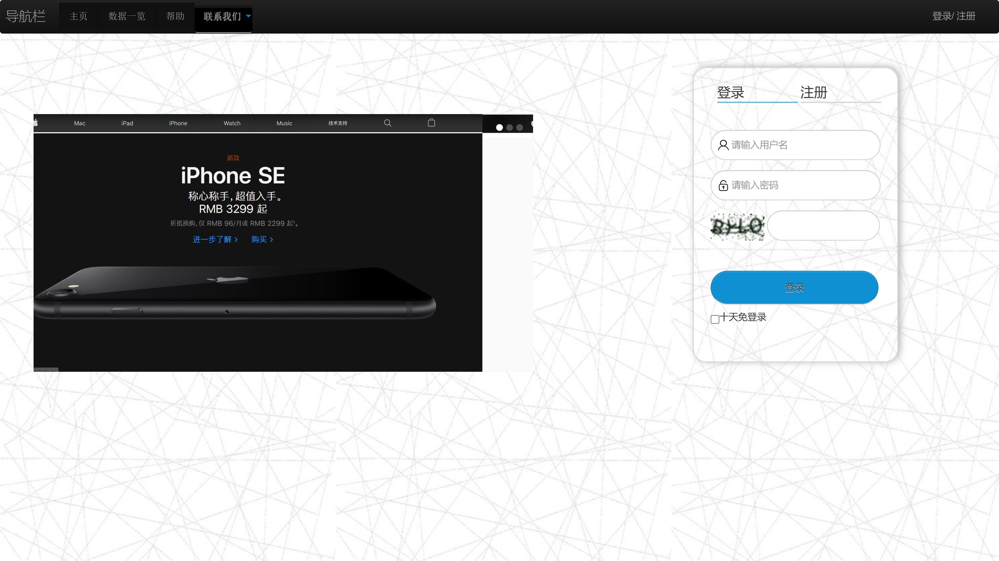
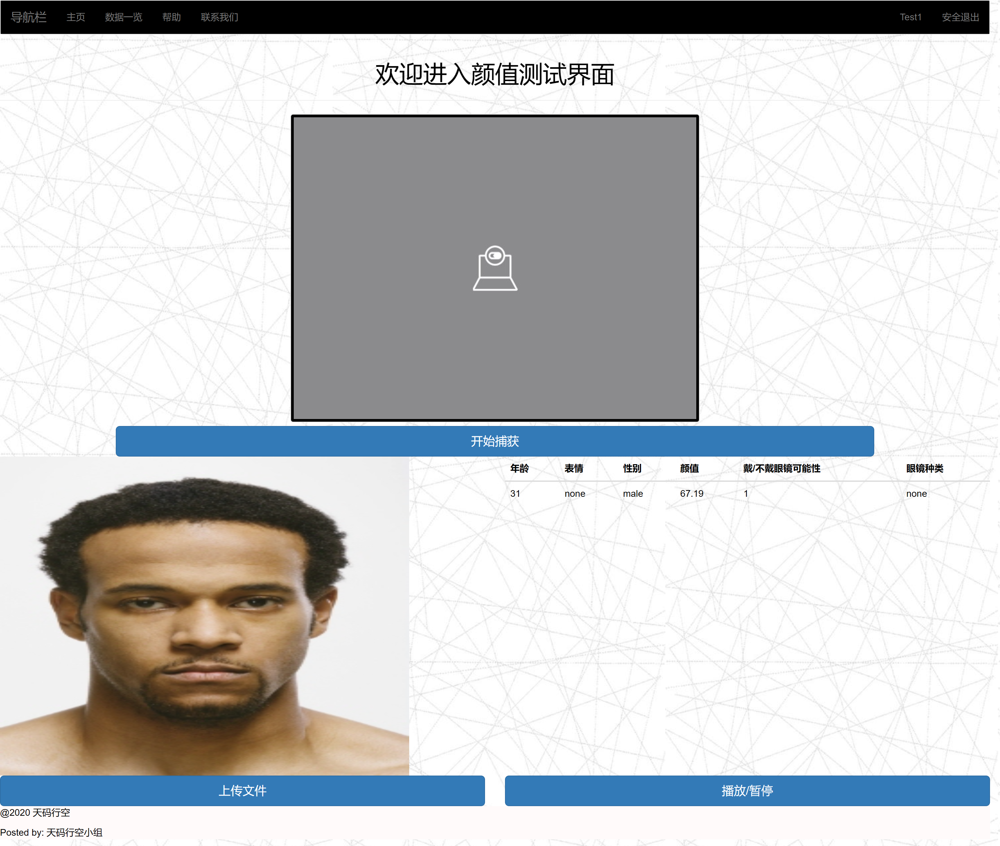
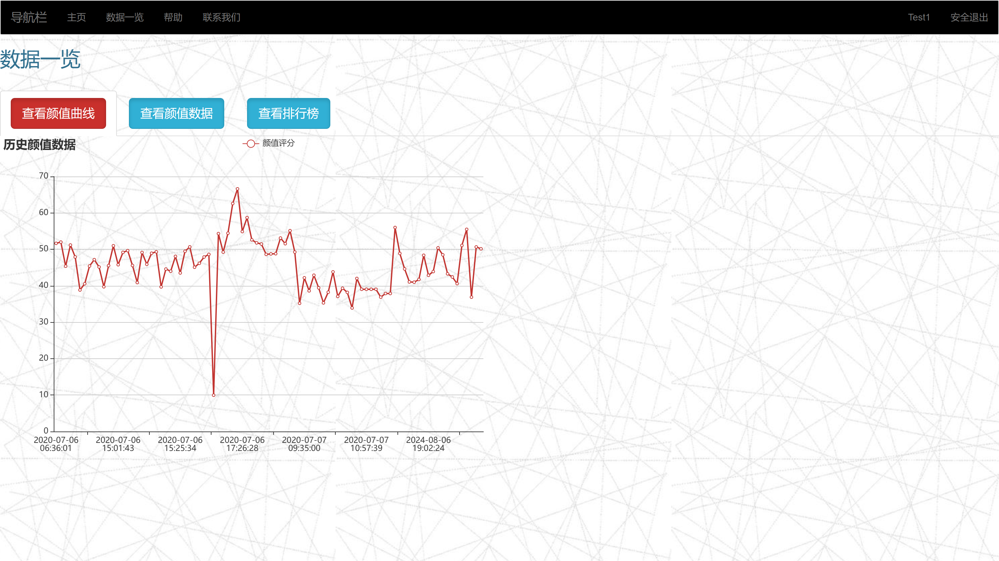
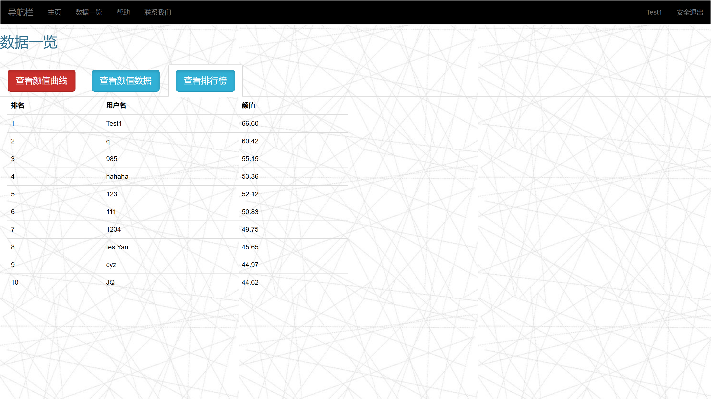

# AppearanceTestWeb Based on Django

## 1. Conda Environment Setup
```
conda create -n faceweb python=3.12.4
cd Django-python-AppearanceTestWeb
pip install -r requirements.txt
conda activate faceweb
```

### If no database, using the following commands:
```
python manage.py makemigrations
python manage.py migrate
```

## 2. Run This Project
```
python ./manage.py runserver 0.0.0.0:8000
```
Then, access [localhost:8000](http://localhost:8000) to view the site pages of this project.

You can log in to access the main features of the project using the following sample user information:
Example User Info：
	- username：Test1
	- password：test1

## 3. Example of AppearanceTestWeb Pages

- 登录界面(Login Interface)



- 网站主页(Home Page)



- 历史数据曲线(Historical Data Curve)



- 历史数据展示(Historical Data Display)


- 排行榜(Ranking List)



- 帮助页面(Help Page)


## 4. References

About Baidu Face Detection

[百度人脸检测API文档(Baidu Face Detection API Documentation)](https://ai.baidu.com/ai-doc/FACE/yk37c1u4t)

[百度智能云控制台-人脸检测(Baidu Console for Face Detection)](https://console.bce.baidu.com/ai/#/ai/face/overview/index)

[百度智能云人脸检测在线API测试(Baidu Face Detection Online API Test)](https://console.bce.baidu.com/support/?u=dhead#/api?product=AI&project=%E4%BA%BA%E8%84%B8%E8%AF%86%E5%88%AB&parent=%E4%BA%BA%E8%84%B8%E5%9F%BA%E7%A1%80API&api=rest%2F2.0%2Fface%2Fv3%2Fdetect&method=post)

About Speech Synthesis Recognition

[百度语音合成API文档(Baidu Speech Synthesis API Documentation)](https://cloud.baidu.com/doc/SPEECH/s/mlbxh7xie)

[百度智能云控制台-语音合成(Baidu Console for Speech Synthesis)](https://console.bce.baidu.com/ai/#/ai/speech/app/list)

[百度智能云语音合成在线API测试(Baidu Speech Synthesis Online API Test)](https://console.bce.baidu.com/support/#/api?product=AI&project=%E8%AF%AD%E9%9F%B3%E6%8A%80%E6%9C%AF&parent=%E8%AF%AD%E9%9F%B3%E5%90%88%E6%88%90&api=rpc%2F2.0%2Ftts%2Fv1%2Fcreate&method=post)
